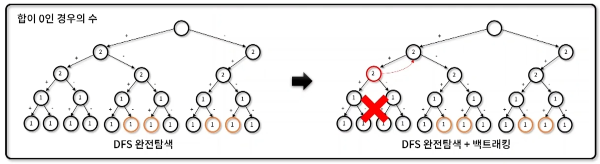

## 백트래킹 (Backtracking)
- 경우의 수로 해를 찾는 도중 `해가 나올 수 없는 조건일 때 이를 중단하고` 다른 경우의 수로 해를 찾는 알고리즘 기법
- 백트래킹 특징
    - 해가 될 가능성이 있으면 지속적 탐색, 가능성이 없다면 가지치키(pruning)하여 빠르게 전체 해를 탐색
    - 해가 되지 않는 경우의 수는 `배재`하여 해를 찾는 `시간복잡도를 단축`

→ 프로그래머스 `타겟넘버` 문제 예시