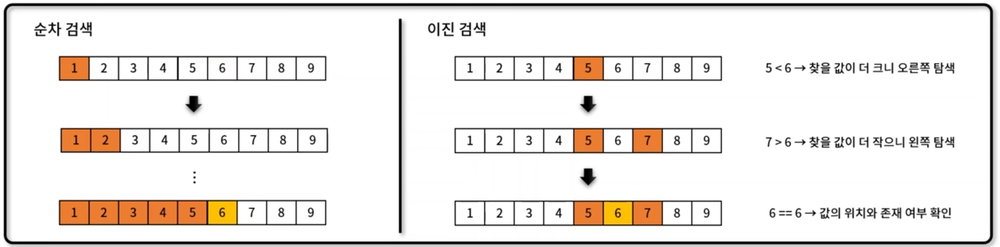

## 이진 검색(Binary Search)
- 자료 구조 기반으로 정렬되어 있는 데이터 안에서 특정 값을 찾는 기법
- 평균 시간 복잡도: $O(longn)$
- 구현 방법 및 메서드 (method)
    - 반복문을 이용한 검색: binarySearch_loop()
    - 재귀를 이용한 검색: binarySearch_recursive()
- 알고리즘 동작 방식
