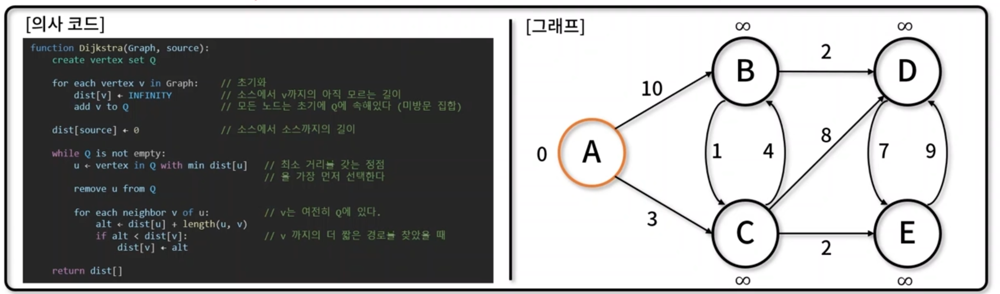

## Dijkstra 알고리즘
- 그래프에서 `출발점과 도착점 사이의 최단 거리`를 구하는 알고리즘
- 보통 단일 정점 간 최단 경로 산출 시 사용, 도로 교통 망이나 OSPF 등의 네트워크 라우팅 프로토콜에 널리 이용
- 구현 메서드(method)
    - 정점/간선 추가: ShortestPath.addVertex(), ShortestPath.addEdge()
    - 다익스트라 알고리즘: ShortestPath._extractMin(), ShortestPath.dijkstra()

