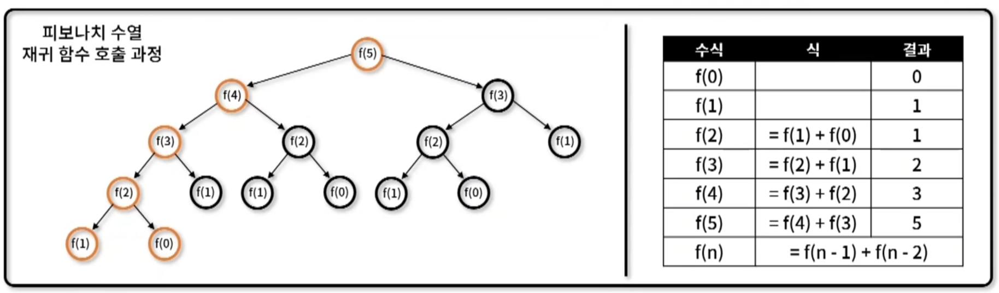

## 동적 계획법 (Dynamic programming)
- `Memoization로 중복 연산을 방지`하며, `작은 부분 문제로 큰 문제를 해결`하며 해를 도출하는 알고리즘 설계 기법
- 동적 계획법 특징
    - `부분 문제는 중복`되며, `상위 문제 해결 시 재사용`
    - Memoization 기법을 사용 (동일한 계산을 반복할 떄, 이전에 계산한 값을 메모리에 저장하여 중복 연산 방지)
    

- 동적 계획법 구현 방식
    - Top-down: 재귀를 통해 큰 문제를 작은 문제로 나눠 해결하며 해를 찾는 방법
    - Bottom-up: 반복문을 통해 작은 문제부터 차례대로 해를 찾는 방법
    ```javascript
    /* top-down*/
    function fibo_td(n, d = []) {
        if(n<2) return n;
        if(d[n]) return d[n];

        d[n] = fibo_td(n - 1) + fibo_td(n-2);
        return d[n];
    }

    console.log(fibo_td(5));
    console.log(fibo_td(6));
    console.log(fibo_td(7));

    /* bottom-up */
    function fibo_bu(n, d = []) {
        d[0] = 0;
        d[1] = 1;

        for(let i = 2; i <= n; i++) {
            d[i] = d[i - 1] + d[i - 2];
        }

        return d[n]
    } 

    console.log(fibo_bu(5));
    console.log(fibo_bu(6));
    console.log(fibo_bu(7));
    ```
