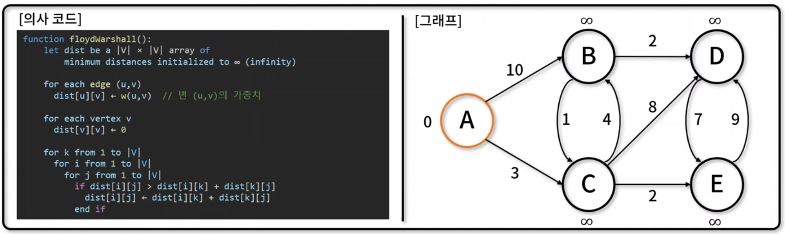

## Floyd-Warshall 알고리즘
- `동적 계획법`을 활용해, 그래프에서 `가능한 모든 정점 쌍에 대해 최단 거리`를 구하는 알고리즘
- 음의 가중치가 있어도 사용 가능하며, 많은 수의 간선으로 이루어져 있는 밀집 그래프(Dense Graph)에 사용 적합
- 구현 메서드(method)
    - 정점/간선 추가: ShortestPath.addVertex(), ShortestPath.addEdge()
    - 플로이드-워셜 알고리즘:ShortestPath.floydWarshall()
    