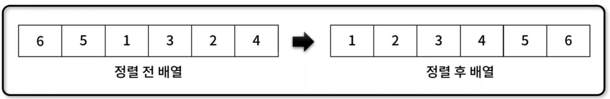
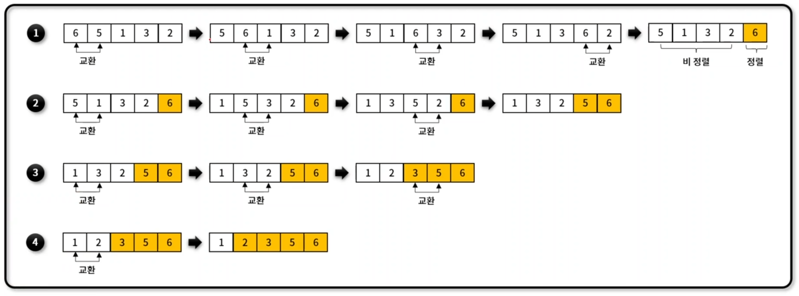
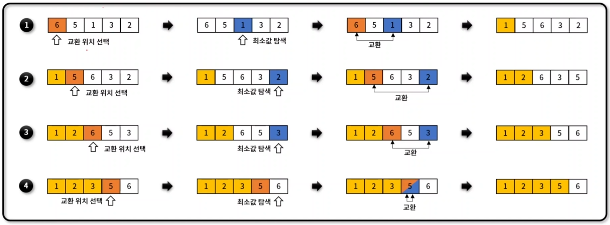
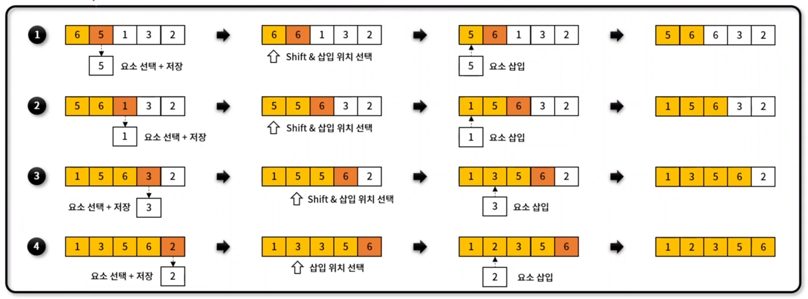
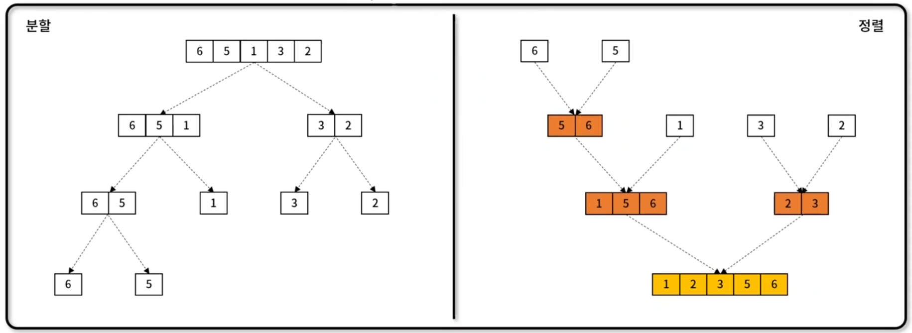
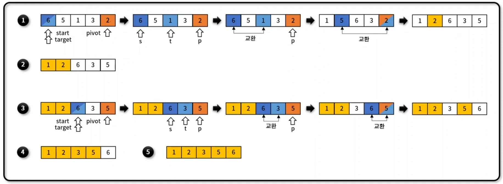

## 정렬 (Sorting)
- 배열 내 원소들을 번호순이나 사전 순서와 같이 `일정한 순서대로 열거`하는 알고리즘
- 대표 정렬 알고리즘 별 구현 함수
    - 거품 정렬(Bubble Sort): buubleSort_1(), bubbleSort_3(), bubbleSort()
    - 선택 정렬(Selection Sort): selectionSort()
    - 삽입 정렬(Insertion Sort): insertionSort()
    - 병합 정렬(Merge Sort): mergeSort()
    - 퀵 정렬(Quick Sort): quickSort()
    - 공통 함수: swap(), ascending(), descending()
    

### 거품 정렬(Bubble Sort)
- 서로 `인접한` 두 원소를 비교하면서 정렬하는 알고리즘
- 평균 시간 복잡도: $O(n^2)$
- 알고리즘 동작 방식

### 선택 정렬(Selection Sort)
- `최솟값을 찾아 데이터 영역의 가장 앞으로 이동`하는 방식을 반복하여 전체 데이터 영역을 정렬하는 알고리즘
- 평균 시간 복잡도: $O(n^2)$
- 알고리즘 동작 방식

### 삽입 정렬(Insertion Sort)
- `이미 정렬`된 데이터 영역과 비교하면서, `자신의 위치를 찾아 요소를 삽입`하며 정렬하는 알고리즘
- 평균 시간 복잡도: $O(n^2)$
- 알고리즘 동작 방식

### 병합정렬(Merge Sort)
- 하나의 배열을 두 개의 균등한 `크기로 분할하고, 부분 정렬하며, 이를 다시 합하면서 전체를 정렬`해가는 알고리즘
- 평균 시간 복잡도: $O(nlogn)$
- 알고리즘 동작 방식

### 퀵정렬(Quick Sort)
- `특정한 값(pivot)을 기준`으로 큰 숫자와 작은 숫자를 `분할`하여 정렬하는 알고리즘
- 평균 시간 복잡도: $O(nlogn)$
- 알고리즘 동작 방식
