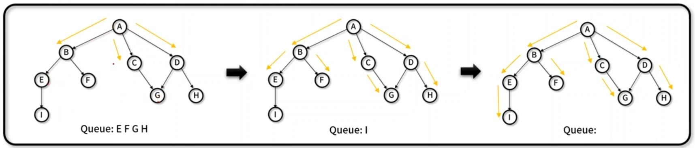

## BFS (Breadth First Search)
- 트리나 그래프 등에서 `인접한 노드를 우선 방문`하면서 `넓게` 움직이며 해를 찾는 탐색 기법
- 장/단점
    - 장점: 최단 경로 탐색에서 구한 해가 정답임을 보장
    - 단점: 경로가 매우 길어질 경우, 탐색 범위가 증가하면서 DFS보다 많은 기억 공간이 필요
- 구현 메서드(method)
    - 큐를 이용한 탐색: Graph.bfs(), Graph._bfsloopVisit()
    - 최단 경로 탐색: Graph.shortestPath(), Graph._bfsShortestPath(), Graph._from_to_path()
    