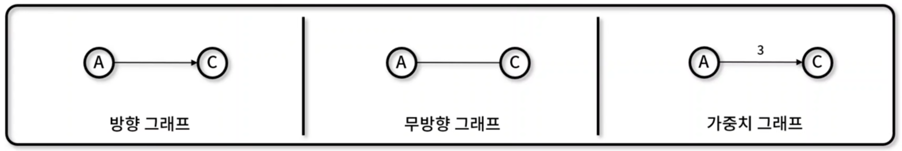

## 그래프 (Graph)
- 정점과 간선으로 구성되어 `네트워크 구조`를 추상화한 비선형 자료 구조
- 그래프 특징
    - 정점(Vertex)과 간선(Edge)의 집합
    - 다양한 그래프 종류를 혼합하여 표현 가능
- 그래프 종류
    - 방향 그래프(Directed Graph): 간선에 특정 방향이 존재하는 그래프(A → B로 포현, A에서 B로만 이동 가능)
    - 무방향 그래프(Undirected Graph): 간선에 특정 방향이 존재하지 않는 그래프 ( A - B로 표현, 양방향 이동 가능)
    - 가중치 그래프(Weighted Graph): 간선에 비용이나 가중치가 할당된 그래프
    
    