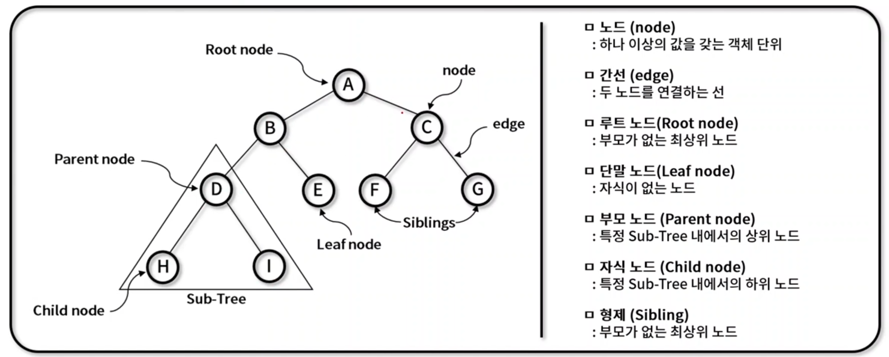
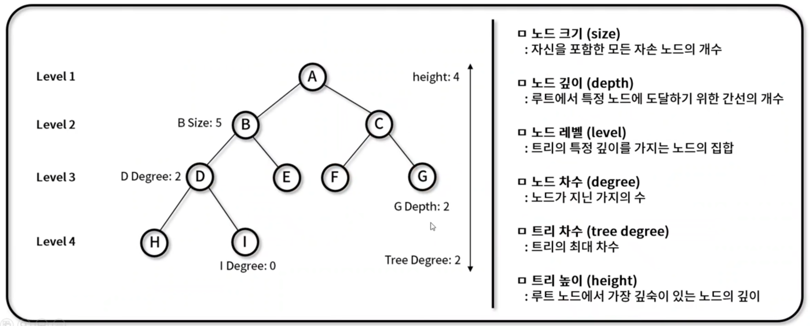
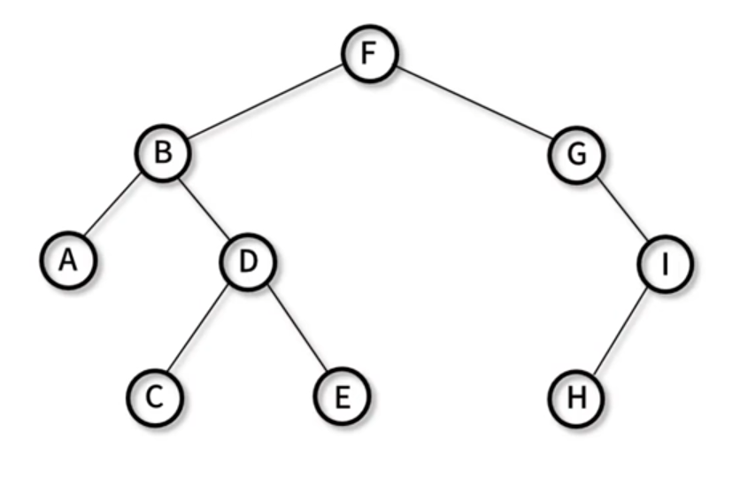
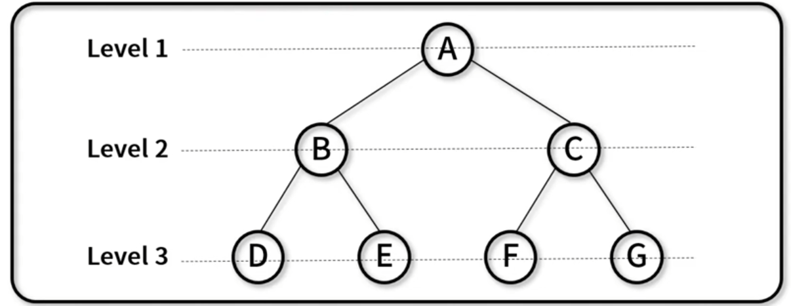
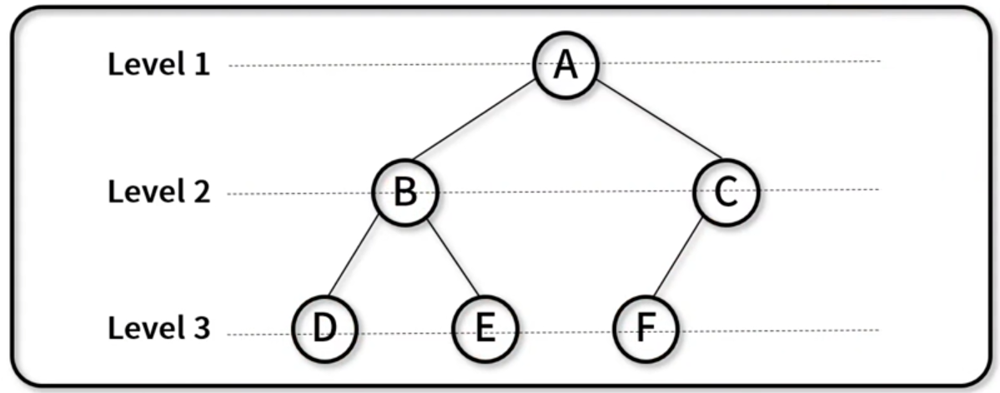
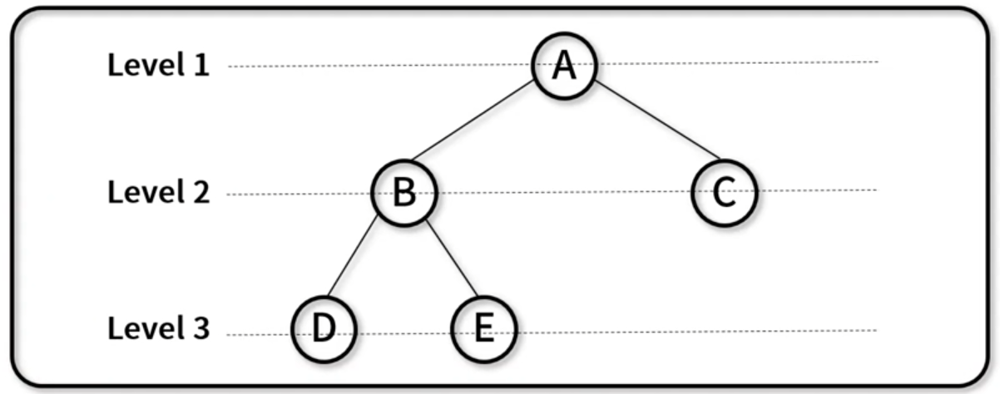
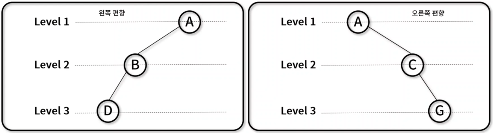
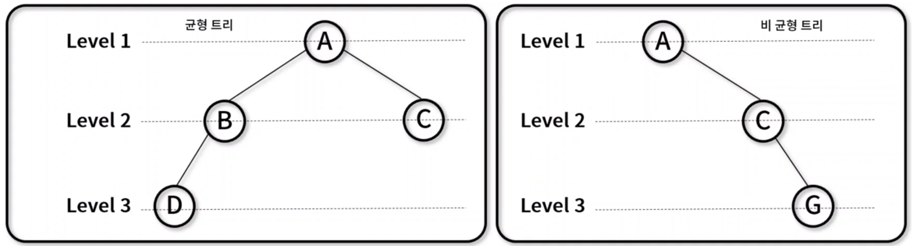
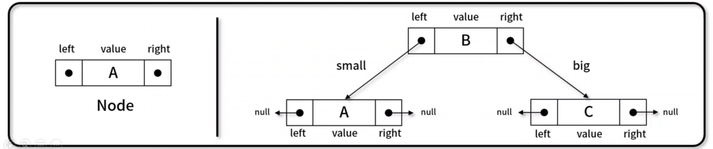
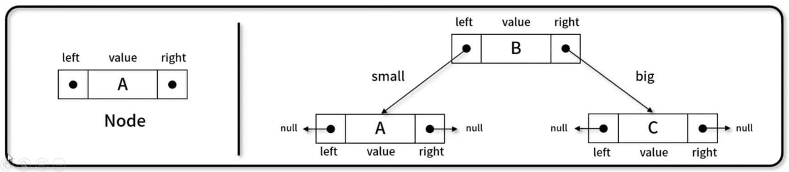

## 트리 (Tree)
- 그래프의 일종으로 `두 노드 사이의 하나의 간선만 연결`되어 있는, 최소 연결과 계층 형태의 비선형 자료 구조
- 트리의 구조 및 용어


## 트리 특징
- 주요 특징: '최소 연결 트리'로 불림, 계층 모델, 방향 비순환 그래프 (DAG: Directed Acyclic Graph) 한 종류
- 트리 종류: 이진 트리, 이진 탐색 트리, AVL 트리, 힙(Heap)


## 트리 순회
- 트리 구조에서 각각의 `노드를 정확히 한 번씩` 체계적인 방법으로 `방문`하는 과정
- 필요 용어
    - N(Node): 해당 노드를 방문
    - L(Left): 왼쪽 서브 트리로 이동
    - R(Right): 오른쪽 서브 트리로 이동
- 순회 방식
    - 전위 순회(Pre-order): `N` - L - R
    - 중위 순회(In-order): L - `N` - R
    - 후위 순회(Post-order): L - R - `N`
    - 층별 순회(Level-order): 낮은 Level부터 순차적으로 순회


## 전위 순회(Pre-order)
- 전위 순회 방법: N - L - R
    1. 노드를 방문한다.
    2. 왼쪽 서브 트리를 전위 순회환다.
    3. 오른쪽 서브 트리를 전위 순회한다.
- 방문 순서
    - F → B → A → D → C → E → G → I → H
- 의사 코드(pseudo-code)
```javascript
preorder(node)
    print node.value
    if node.left !== null then preorder(node.left)
    if node.right !== null then preorder(node.right)
```

## 중위 순회(In-order)
- 중위 순회 방법: L - N - R
    1. 왼쪽 서브 트리를 중위 순회한다.
    2. 현재 노드를 방문한다.
    3. 오른쪽 서브 트리를 중위 순회한다.
- 방문 순서
    - A → B → C → D → E → F → G → H → I
- 의사 코드
```javascript
inorder(node)
    if node.left !== null then inorder(node.left);
    print node.value
    if node.right !== null then inorder(node.right);
```

## 후위 순회(Post-order)
- 후위 순회 방법: L - R - N
    1. 왼쪽 서브 트리를 후위 순회한다.
    2. 오른쪽 서브 트리를 후위 순회한다.
    3. 현재 노드를 방문한다.
- 방문 순서
    - A → C → E → D → B → H → I → G → F
-의사 코드(pseudo-code)
```javascript
postorder(node)
    if node.left !== null then postorder(node.left)
    if node.right !== null then postorder(node.right)
    print node.value
```


## 층별 순회(Level-order) → BFS
- 층별 순회 방법: 낮은 Level부터 순차적으로 순회
    1. root 노드 방문
    2. Level 증가
    3. 왼쪽에서 오른쪽 순으로 방문
- 방문 순서
    - F → B → G → A → D → I → C → E → H
- 의사 코드(pseudo-code)
```javascript
levelorder(root)
    q.enqueue(root)
    while not q.empty do
        node := q.dequeue()
        print node.value
        if node.left !== null q.enqueue(node.left)
        if node.right !== null q.enqueue(node.right)
```

## 이진 트리 (Binary Tree)
- 각각의 노드가 `최대 두개의 자식 노드`를 가지는 트리 자료 구조
- 활용 방식
    - 검색과 정렬: 이진 탐색 트리와 이진 힙 구현에 활용
    - 허프만 코딩: 연관 분기 구조 위한 데이터 표현에 활용
- 이진 트리의 종류
    - 포화 이진 트리 (Perfect binary tree)
    - 완전 이진 트리 (Complete binary tree)
    - 정 이진 트리 (Full binary tree)
    - 편향 이진 트리 (Skewed binary tree)
    - 균형 이진 트리 (Balanced binary tree)


## 포화 이진 트리 (Perfect binary tree)
- 모든 레벨의 노드가 가득 채워져 있는 트리
- 특징
    - Leaf 노드를 제외한 모든 자식은 2개의 노드를 보유
    - 노드의 개수: $n = 2^h - 1 (h : level)$
- 트리 형태

→ $2^3 - 1 = 7$개의 노드가 있다.

## 완전 이진 트리 (Complete binary tree)
- 마지막 레벨 전까지 노드가 가득 채워져 있고, 마지막 레벨은 왼쪽부터 순차적으로 채워져 있는 트리
- 특징
    - 배열을 사용해 효율적인 표현이 가능
    - 노드의 개수:  $n < 2^h - 1 (h : level)$
- 트리 형태

→ 마지막 레벨의 노드는 왼쪽부터 순차적으로 채워져야 한다!

## 정 이진 트리 (Full binary tree)
- 모든 노드가 0개 또는 2개의 자식 노드만 갖는 트리
- 특징
    - proper 또는 plane 이진 트리라고도 불림
    - 노드의 개수: $ n ≤ 2^h - 1$
- 트리 형태


## 편향 이진 트리 (Skewed binary tree)
- 왼쪽 혹은 오른쪽으로 편향되게 치우쳐 있는 트리
- 특징
    - 각각의 높이에 하나의 노드만 존재
    - 노드의 개수 : $h$
- 트리 형태


## 균형 이진 트리 (Balanced binary tree)
- 삽입/삭제가 이루어 질 때, 왼쪽 서브 트리와 오른쪽 서브 트리의 높이 차를 1 이하로 맞추는 이진 탐색 트리
- 특징
    - 서브 트리 높이 차이가 항상 1 이하로 유지
    - 균형 트리 종류: AVL 트리, Read-Black 트리, B 트리, B+ 트리, B* 트리
    - 보통 AVL 트리로 많이 불린다.
- 트리 형태


## 이진 트리 순회 (Binary Tree Traversal)
- 각각의 노드가 `최대 두개의 자식 노드`를 가지는 트리 자료 구조를 순회하는 방법
- 구현 메서드(methd)
    - 노드 추가: BinaryTree._inserNode(), BinaryTree.insert()
    - 전위 순회:(Pre-order): BinaryTree._preOrderTraverseNode(), BinaryTree.preOrderTraverse()
    - 중위 순회(In-order): BinaryTree._inOrderTraverseNode(), BinaryTree.inOrderTraverse()
    - 후위 순회(Post-order): BinaryTree._postOrderTraverseNode(), BinaryTree.postOrderTraverse()
    - 층별 순회(Level-order): BinaryTree.levelOrderTraverse()
    

## 이진 탐색 트리 (Binary Search Tree)
- 현재 노드를 기준으로 `왼쪽에는 작은 값, 오른쪽은 큰 값으로 정렬`해 놓은 이진 트리 기반 자료 구조
- 구현 메서드(method)
    - 노드 추가:BinarySearchTree._insertNode(), BinarySearchTree.insert()
    - 노드 탐색(최댓값): BinarySearchTree._maxNode(), BinarySearchTree.max()
    - 노드 탐색(최솟값): BinarySearchTree._minNode(), BinarySearchTree.min()
    - 노드 탐색(특정값): BinarySearchTree._searchNode(), BinarySearchTree.search()
    - 노드 삭제: BinarySearchTree._findMinNode(), BinarySearchTree._removeNode(), BinarySearchTree.remove()
    