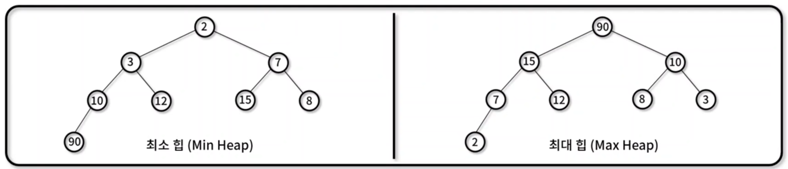
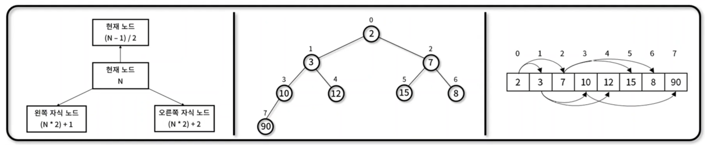

## 힙(Heap)
- 최댓값 혹은 최솟값을 빠르게 찾기 위해 완전이진트리 형태로 연산을 수행하는 자료 구조
- 힙 대표 속성
    - 정렬: 각 노드의 값은 자식 노드가 가진 값보다 작거나 혹은 큰 순서대로 정렬
    - 형태: 트리의 형태는 완전이진트리(Complete binary tree) 모양
- 힙 종류
    - 최소 힙 (Min Heap): 부모 노드의 값이 자식 노드의 값보다, 작거나 같은 완전 이진 트리
    - 최대 힙 (MAx Heap): 부모 노드의 값이 자식 노드의 값보다, 크거나 같은 완전 이진 트리
    
- 힙 구현
    - 완전이진트리 성질을 만족하기 때문에 1차원 배열로 표현 가능
    - 현재 노드: N, 부모 노드: (N-1) / 2, 왼쪽 자식 노드: (N * 2) + 1, 오른쪽 자식 노드: (N*2)+2
- 구현 메서드(method)
    - 노드 위치 계산: Heap.parentIndex(), Heap.leftChildIndex(), Heap.rightChildIndex()
    - 노드 값 확인: Heap.parentIndex(), Heap.leftChildIndex(), Heap.rightChildIndex()
    - 노드 추가 / 삭제(추출): Heap.insert(), Heap.bubbleUp(), Heap.extract(), Heap.bubbleDown()
    