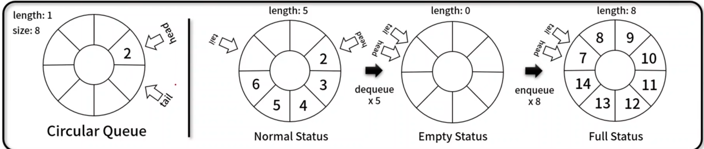

## 원형 큐(Circular Queue)
- 원형 형태를 가지며, 먼저 넣은 데이터가 먼저 나오는 FIFO 기반의 선형 자료 구조
- 구현 메서드(method)
    - 데이터 꽉 찼는지 / 비어 있는지 확인: CircularQueue.isEmpty(), CircularQueue.isFull()
    - 데이터 추가 / 삭제 / 반환: CircularQueue.enqueue(), CircularQueue.dequeue(),  CircularQueue.getBuffer()
    - 첫번째 데이터 / 사이즈 / 전체 삭제: CircularQueue.front(), CircularQueue.size(), CircularQueue.clear()
    