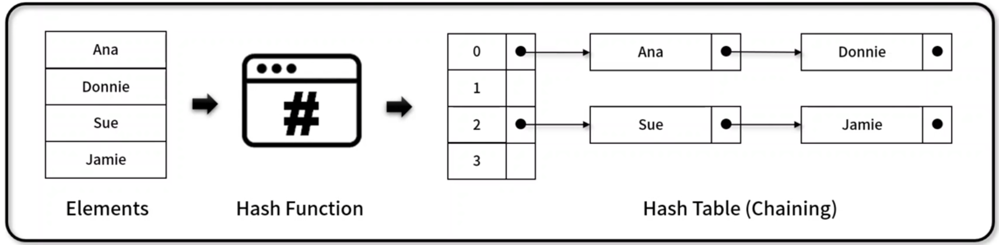

## 체이닝 해시테이블(Chaining Hash Table)
- `별도의 자료구조인 연결 리스트를 병합 사용`하여 Hash 충돌을 해결한 해시테이블 기반 자료구조
- 구현 메서드(method)
    - 객체 초기화 / 크기 반환: ChainingHashTable.clear(), ChainingHashTable.size()
    - 전체 데이터 반환, 전체 데이터 출력: ChainingHashtable.getBuffer(), ChainingHashTable.print()
    - 추가 / 삭제 / 반환: ChaininghashTable.put(), ChainingHashTable.remove(), ChainingHashTable.get()
    