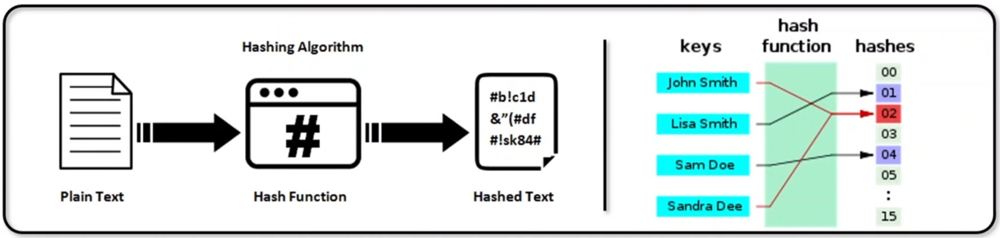
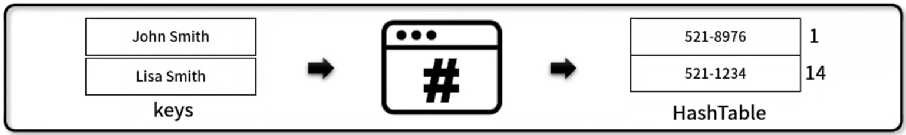

## 해시함수 (Hash Function)
- 임의의 길이의 데이터를 `고정된 길이의 데이터로 매핑`하는 함수
- 해시 함수 특성
    - 압축성: 다양한 가변길이의 입력에 대해 고정된 크기의 결과값을 반환하는 성질
    - 효율성: 어떤 입력 값에 대해서도 많은 자원과 시간이 소요되지 않고 처리되는 성질
    - 저항성: 결과값을 바탕으로 입력 값을 찾는 것이 불가능한 성질
        - 저항성이란 쉽게 말해서 아래의 그림처럼 Plain Text 값이 해시 함수에 의해 Hashed Text로 변환된 값을 다시 Plain Text 값으로 변환하는 것이 불가능하다라는 것을 말함
    
    - 해시 함수의 예시
        - 회원가입 시 비밀번호를 데이터 베이스에 저장할 때 해싱된 값을 넣는다.
        → 즉 사용자가 입력한 비밀번호를 저장하는 것이 아닌 해싱 함수에 의해 Hashed가 된 결과 값을 데이터베이스에 저장함
        → 실제 비밀번호가 저장되지 않는 보안에서의 장점이 있지만 해쉬 함수를 바꾸게 되면 모든 비밀번호를 바꿔야함
        → 해쉬 함수의 로직이 변하지 않는 이상 동일한 입력으로 다른 결과 값이 나올 수 없음

## 해시테이블 (Hash Table)
- `Hash 함수를 사용`하여 평균 O(1) 시간 복잡도로 특정 값을 신속하게 찾는 자료 구조
- 충돌(Collision) 해결 방법
    - 해시 함수 변경: 더 큰 숫자의 공간과 Modular 산술 값을 이용해 충돌 최소화
    - 자료 구조 확장: Open Addressing Method (선형 조사법, 이중해시), Close Addressing Method(체이닝)
- 구현 메서드(Method)
    - 객체 초기화 / 크기 반환: HashTable.clear(), Hashtable.size()
    - 전체 데이터 반환, 전체 데이터 출력: HahshTable.getBuffer(), HashTable.print()
    - 데이터 추가 / 삭제 / 반환: HashTable.put(), HashTable.remove(), HashTable.get()
    