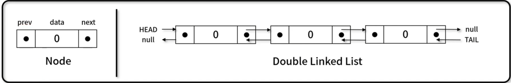

# 이중 연결 리스트 (Double Linked List)
- 각 노드가 데이터와 포인터를 가지며, 두 줄로 연결되어 있는 방식으로 데이터를 저장하는 자료 구조
- 구현 메서드(method)
    - 노드 개수 / 비어 있는지 확인: DoubleLinkedList.size(), DoubleLinkedList.isEmpty()
    - 순차 출력 / 역 출력: DoubleLinkedList.printNode(), DoubleLinkedList.printNodeInverse()
    - 노드 추가: DoubleLinkedList.append(), DoubleLinkedList.insert()
    - 노드 삭제: DoubleLinkedList.remove(), DoubleLinkedLIst.removeAt()
    - 데이터 위치 확인: DoubleLinkedList.indexOf()
    
