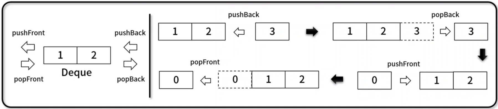

## 데크 (Deque)
- Dobule-Ended Queue 약자로, 삽입과 삭제가 양쪽 끝에서 모두 발생할 수 있는 선형 자료 구조
- 구현 메서드(method)
    - 데이터 전체 획득 / 비어 있는지 확인: Deque.getBuffer(), Deque.isEmpty()
    - 데이터 추가 / 삭제: Deque.pushFront(), Deque.popFront(), Deque.pushBack(), Deque.popBack()
    - 첫번째 & 끝 데이터 반환 / 사이즈 / 전체 삭제: Deque.front(), Deque.back(), Deque.size(), Deque.clear()
    ;